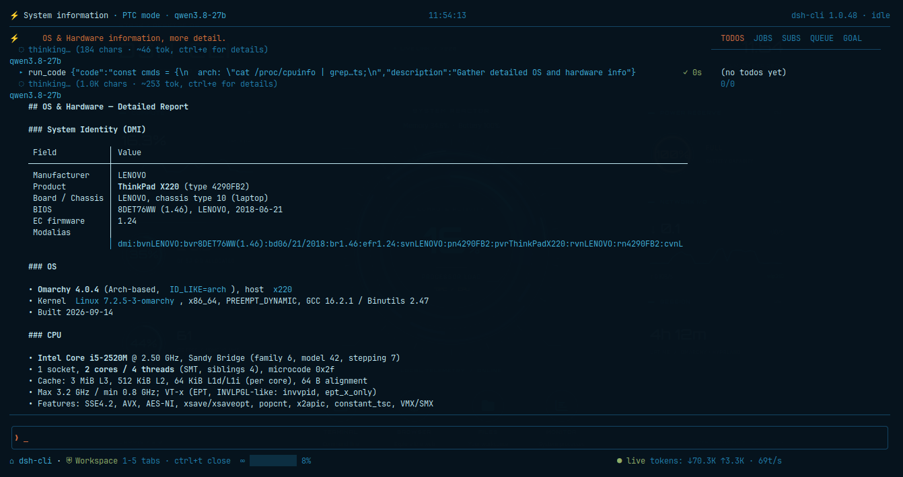
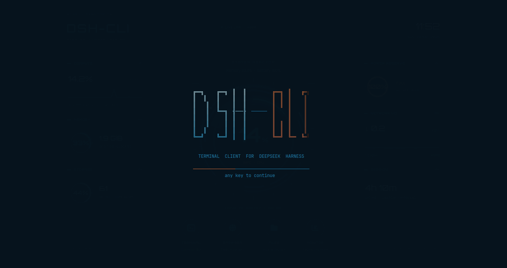
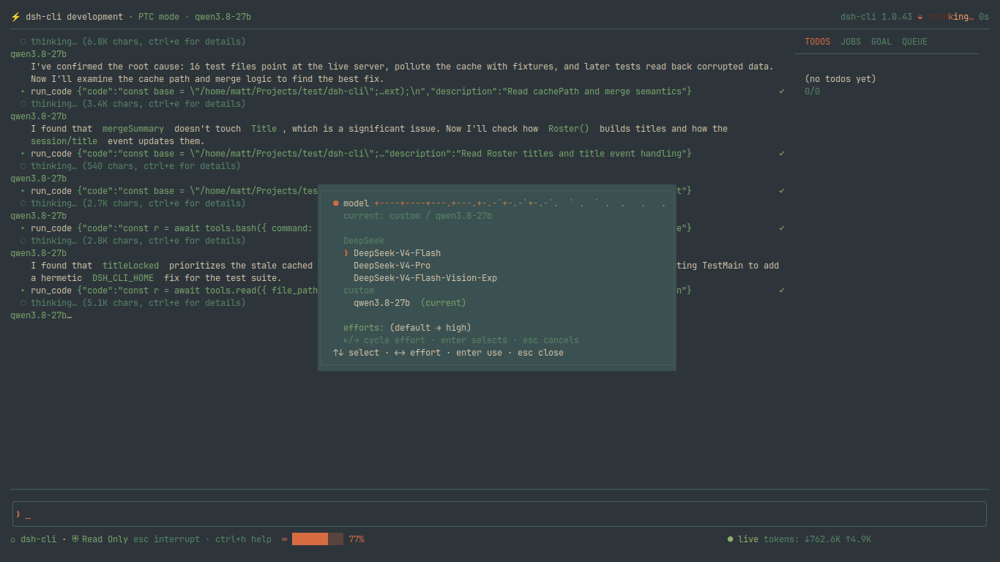
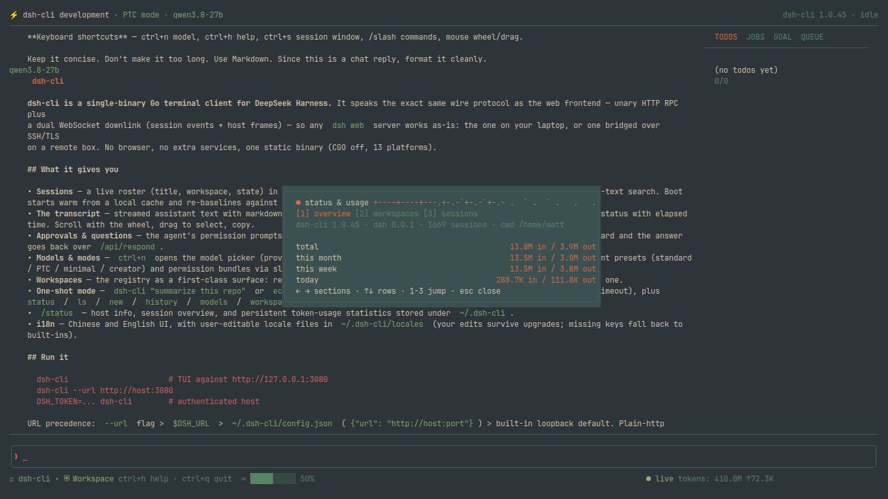
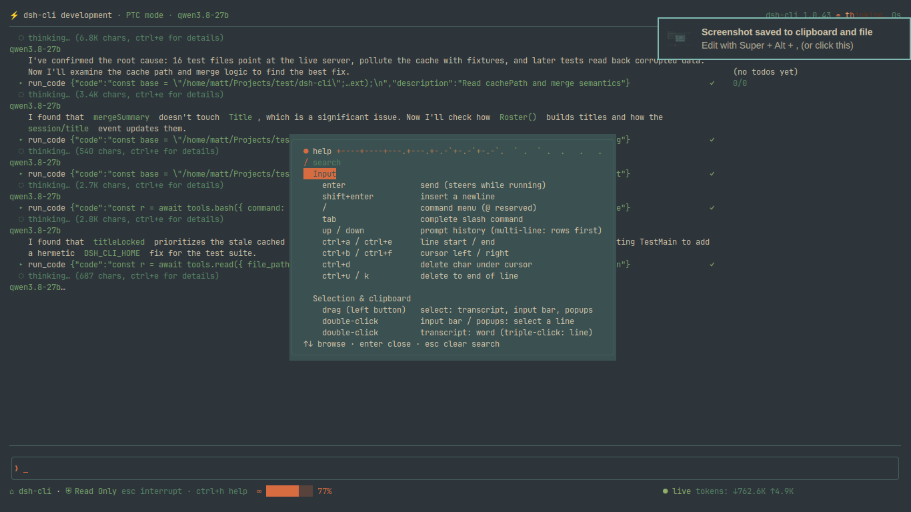

<div align="center">

# ⚡ dsh-cli

**The DeepSeek Harness, in your terminal.**

Enjoy DeepSeek Harness, straight from your terminal — **One Go binary. No Node. No frontend build step.**


</div>

<div align="center">

🇺🇸 English · [🇨🇳 阅读中文版](README_cn.md)

</div>

---

## What is this

dsh-cli is the terminal client for DeepSeek Harness (`dsh web`). It speaks the **exact same protocol** as the web client — so everything you can do in the browser, you can do from the keyboard, and the two front-ends are swappable:

- 💬 **Watch the agent work, live** — streaming output; tool cards show what ran, what changed, and how long it took; expandable thinking;
- ✅ **One-keystroke approvals** — the agent wants to run a command? A popup appears: `ctrl+a` to allow, `ctrl+r` to reject. Its questions get answered in the popup too;
- 🔄 **Switch anything, any time** — model, permission level, work mode, workspace: each has a hotkey, and it works mid-turn;
- 📊 **Dashboard & stats** — todos, background jobs, the current goal, and the message queue; token spend by time / workspace / session;
- 🖱️ **Full keyboard + mouse support**, with colors that follow your terminal's theme;
- ⌨️ **Pipe-friendly one-shot mode** — `dsh-cli "summarize this repo"` just prints the answer; drop it into scripts and CI.

## A look

<div align="center">



</div>

## 🚀 60-second start

**Prerequisite**: a running DSH web server (`dsh web`, default `http://127.0.0.1:3080`).

```sh
make deps      # first time: download modules
make check     # vet + tests + build → produces ./dsh-cli

./dsh-cli                          # interactive TUI (connects to 127.0.0.1:3080)
./dsh-cli --url http://host:8080   # connect to a remote server
```

> Remote use needs `--trusted-host` on the server side; local loopback needs no auth.
> The server restarting or the network blipping is no big deal: it reconnects and re-syncs on its own.

What you see on first launch:

<div align="center">



</div>

## ✨ Features, in detail

**Watching the work**

- **Live streaming** — the agent thinks and talks as it works; messages render as they arrive; tool cards carry args, duration, and ✓/✗;
- **Turn verdicts** — `✓ done` / `⏹ interrupted` / `✗ error` / `⚠ max tokens`, with the duration and the turn's tokens at a glance;
- **Thinking & detail** — thinking blocks are folded by default; `ctrl+e` expands the full reasoning and tool output;
- **Full GFM rendering** — tables, task lists, strikethrough, emoji: whatever the web renders, this does.

**Approvals & interaction**

- Tool approvals and user questions pop up on arrival; parked ones reopen any time with `ctrl+i`;
- Sending while a turn is running is a **steer** (it redirects the current turn); queued messages are visible in the strip, and `ctrl+x` drops the oldest one.

**Switching (each has a hotkey; all work mid-turn)**

- **Model** (`ctrl+n`) — provider → model → reasoning effort, three levels; `←→` cycles the effort; `/model <name>` jumps straight there (a unique prefix works too);
- **Permission** (`ctrl+p`) — cycle read-only → workspace-write → full access; no model turn involved, no waiting;
- **Mode** (`ctrl+o`) — Standard / PTC / Minimal / Creator plus your own presets; blank sessions apply instantly, running sessions stage it for the next new session;
- **Workspace** (`ctrl+w`) — add / rename / remove / switch (switching lands on a blank session; one is created if needed).

The `ctrl+n` model picker:

<div align="center">



</div>

**Sessions**

- **Session window** (`ctrl+s`) — live search (title / id / content), switch, new, rename;
- **Fork** (`f`) — branch a new session from where you're looking — the web's branch button, on the keyboard;
- **Resumes where you left off** — your last session and workspace are ready at boot.

**Mouse & clipboard**

- Wheel to scroll; drag to select, double-click a word, triple-click a line;
- **Release auto-copies** — via the system clipboard binary (wl-copy / pbcopy / clip / xclip), or the terminal's built-in OSC 52 channel when none is installed; no CGO required;
- `ctrl+c` or `ctrl+shift+c` copies the selection again; `esc` clears it.

**Look & resilience**

- **Bilingual UI** — English is built into the binary (it can never be lost), Chinese ships in the box; `/language zh` flips it in a heartbeat, and the choice survives restarts;
- **Theme following** — colors derive from your terminal's theme and re-tint when it changes; unresponsive terminals fall back to a built-in neutral palette;
- **Self-healing connection** — a down server shows `connecting…`; when it's back, missing state is re-synced. Nothing lost.

## 📮 One-shot / pipe mode

For scripts, CI, or when you just want the answer:

```sh
dsh-cli "summarize this repo"           # auto-picks a session, prints the final answer
dsh-cli --new "explain go slices"       # run in a fresh session
echo "explain go slices" | dsh-cli      # read the prompt from stdin
dsh-cli -v "reply in one word"          # stream live + print tool calls
dsh-cli --thinking "solve: 1+1"         # also print the reasoning
```

- The final answer goes to **stdout** (raw markdown); progress and tool activity go to **stderr** — pipe it anywhere;
- Useful flags: `--url`, `--session <id>`, `--new`, `--cwd <dir>`, `--preset <mode>`, `-v`, `--thinking`, `--timeout 2m`, `--version`;
- The fine print: a bare TTY with no prompt fails fast with a nudge (it's usually a forgotten prompt); stdin is capped at 1MiB; the timeout defaults to 10m and a timeout exits `3`, so scripts can branch on it; a missing server gets a one-line "start it with `dsh web --no-open`" hint.

## 🔍 Inspection commands

| Command | Does |
|---|---|
| `dsh-cli status` | Client + host versions, cwd, model, session and workspace counts |
| `dsh-cli ls` | Every session: state / mode / last activity / title / cwd |
| `dsh-cli new` | Create a session and print its id (`--cwd` for a directory, `--preset` for a mode) |
| `dsh-cli history <id>` | Export a full transcript as plain text |
| `dsh-cli models [id]` | Current model + full directory (defaults to the most recent active session) |
| `dsh-cli workspaces` | The workspace registry: title / path / session count |

The `/status` window in the terminal (the table above, plus token usage stats):

<div align="center">



</div>

## ⌨️ Key bindings

| Key | Does |
|---|---|
| `enter` | Send (mid-turn = steer the agent) |
| `shift+enter` | Insert a newline |
| `/` | Command menu, `tab` completes |
| `esc` | Interrupt the turn / close popups / clear input |
| `ctrl+n` | Pick a model (`←→` sets reasoning effort) |
| `ctrl+p` | Cycle permission level |
| `ctrl+o` | Switch work mode |
| `ctrl+w` | Manage workspaces |
| `ctrl+s` | Session window (search / switch / new / rename) |
| `f` | Fork a session at the view position (input empty) |
| `ctrl+b` | Dock: todos / jobs / goal / queue (`1`–`4` switches tabs) |
| `ctrl+e` | Toggle detail: full thinking, tool output (input empty) |
| `ctrl+i` | Reopen a parked question / approval |
| `ctrl+x` | Drop the oldest queued message |
| `←` / `→` | Previous / next session (input empty) |
| `ctrl+a` / `ctrl+r` | In the approval popup: allow once / reject |
| `ctrl+h` | Help (with search) |
| `ctrl+q` / `ctrl+d` | Quit (input empty) |

Above the input line there's also the `/` command menu: `/help` `/status` `/new` `/title` `/model` `/mode` `/search` `/workspace` `/language [en|zh]` — plus host commands such as `/plan` `/compact` `/goal` and skills.

The `ctrl+h` help window (searchable):

<div align="center">



</div>

## 📦 Good to know

- **Dependencies**: Go 1.27+ (to build) and a running `dsh web` (default `http://127.0.0.1:3080`).
- **Server address**: precedence is the `--url` flag > the `$DSH_URL` env var > `~/.dsh-cli/config.json` (`{"url": "http://host:port"}`) > the built-in default; a failed boot connection hints at starting DSH with `dsh web --no-open`.
- **Default language**: `"language"` in `~/.dsh-cli/config.json` wins; unset, the UI follows the system locale (`LC_ALL`/`LC_MESSAGES`/`LANG`); with neither available, built-in English. A `/language` switch writes the choice back, so it survives restarts.
- **Local data**: config, locale files, cache and usage stats all live under `~/.dsh-cli`.
- **License**: [GNU GPLv3](LICENSE).

---

<div align="center"><sub>⚡ dsh-cli — the DeepSeek Harness, in your terminal.</sub></div>

<div align="center"><sub>[🇨🇳 阅读中文版](README_cn.md)</sub></div>
