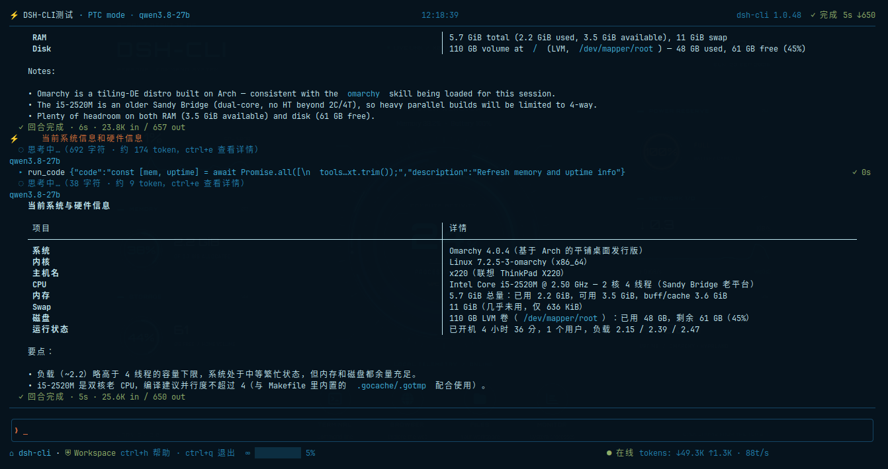
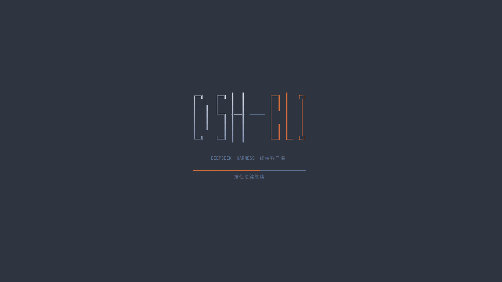
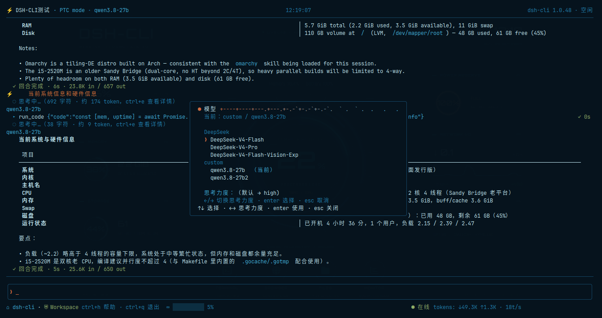
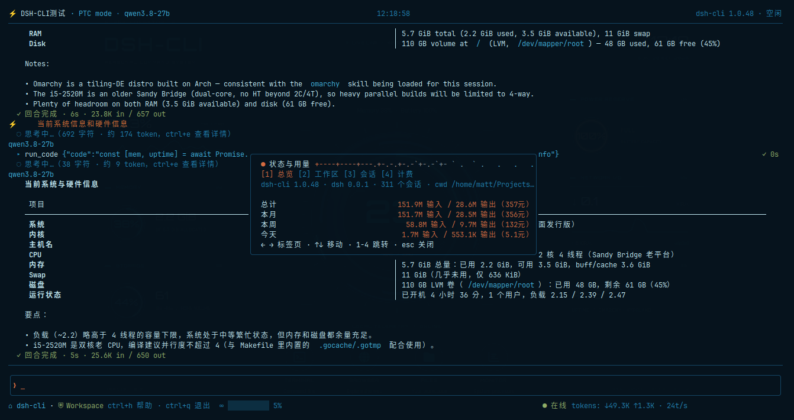
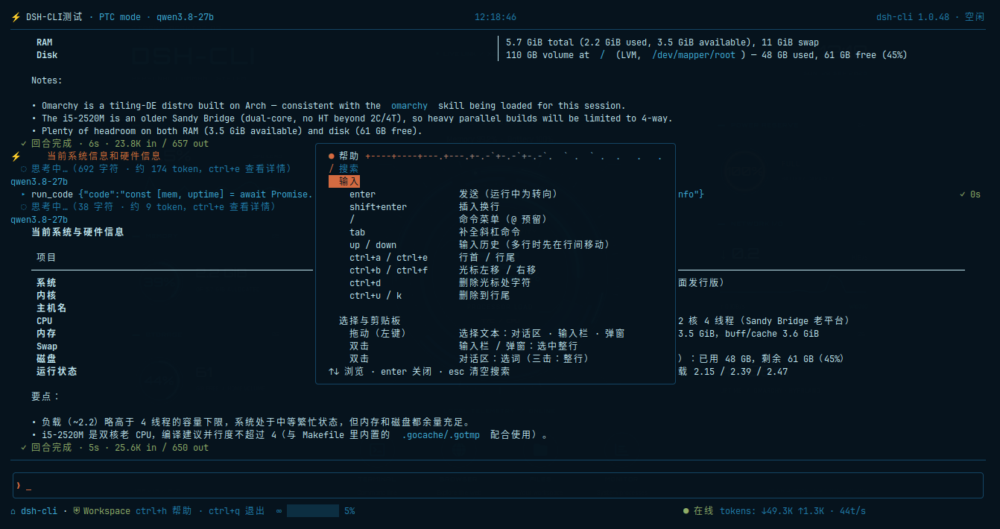

<div align="center">

# ⚡ dsh-cli

**DeepSeek Harness，装进你的终端。**

*DeepSeek Harness, in your terminal.*

在终端里愉快的操作Deepseek Harness——**一个 Go 二进制，无需 Node，无需前端构建**。


</div>

<div align="center">

🇨🇳 中文 · [🇺🇸 Read in English](README.md)

</div>

---

## 这是什么

dsh-cli 是 DeepSeek Harness（`dsh web`）的终端客户端，和网页端**说的是同一种协议**——浏览器里能做的，终端里全能做，两种前端随时互换：

- 💬 **实时看 Agent 干活**：流式输出、工具调用（跑了什么命令、改了什么文件、花了多久）、思考过程随时展开；
- ✅ **一键审批**：Agent 想执行命令，弹个窗，`ctrl+a` 允许、`ctrl+r` 拒绝；向用户提问，也直接在弹窗里回答；
- 🔄 **随时切换**：模型、权限等级、工作模式、工作区，各有专属快捷键，回合运行中也能切；
- 📊 **看板与统计**：待办、后台任务、当前目标、消息队列四个标签页；token 用量按时间 / 工作区 / 会话细分；
- 🖱️ **完整键盘 + 鼠标支持**，颜色从你的终端主题自动派生；
- ⌨️ **管道友好的一次性模式**：`dsh-cli "总结这个仓库"` 直接把答案打印出来，脚本和 CI 里随手就用。

## 一瞥

<div align="center">



</div>

## 🚀 60 秒上手

**前提**：一台运行中的 DSH Web 服务器（`dsh web`，默认 `http://127.0.0.1:3080`）。

```sh
make deps      # 第一次：下载依赖
make check     # vet + 测试 + 构建 → 得到 ./dsh-cli

./dsh-cli                          # 启动终端界面（连本机 127.0.0.1:3080）
./dsh-cli --url http://host:8080   # 连接远端服务器
```

> 远端使用需服务端开启 `--trusted-host`；本机 loopback 免认证。
> 服务器重启、网络抖动都不怕：自动重连、自动恢复现场。

第一次启动的样子：

<div align="center">



</div>

## ✨ 功能详解

**看干活**

- **实时流式**：Agent 边想边说，消息边到边渲染；工具卡片带参数、耗时、✓/✗；
- **回合结果**：`✓ done` / `⏹ interrupted` / `✗ error` / `⚠ max tokens`，附耗时和本回合 token，一眼看懂；
- **思考与细节**：思考块默认折叠，`ctrl+e` 展开全文与工具输出；
- **完整 GFM 渲染**：表格、任务列表、删除线、emoji——网页端能渲染的，这里都能。

**审批与交互**

- 工具审批、用户提问，新到达的自动弹出；搁置的随时 `ctrl+i` 重开；
- 回合运行中再发消息 = **steer**（转向当前回合）；排队中的消息在队列栏可见，`ctrl+x` 丢弃最旧的一条。

**切换（各有一个专属键，回合运行中可用）**

- **模型**（`ctrl+n`）：provider → 模型 → 思考强度三级，`←→` 调强度；`/model <名称>` 直接切，唯一前缀也行；
- **权限**（`ctrl+p`）：read-only → workspace-write → full access 循环，不经模型回合，不用等；
- **模式**（`ctrl+o`）：Standard / PTC / Minimal / Creator + 自建预设；空白会话当场生效，运行中的会话为下一个新会话暂存；
- **工作区**（`ctrl+w`）：添加 / 改名 / 移除 / 切换（切换落到空白会话，没有就新建）。

`ctrl+n` 模型切换窗口：

<div align="center">



</div>

**会话**

- **会话窗口**（`ctrl+s`）：实时搜索（标题 / ID / 内容）、切换、新建、重命名；
- **分叉**（`f`）：从视口位置分出新会话——网页端分支按钮的键盘版；
- **启动即恢复**：上次的会话和工作区，开机即就绪。

**鼠标与剪贴板**

- 滚轮滚动；左键拖拽选择，双击选词、三击选整行；
- **松开即自动复制**：走系统剪贴板二进制（wl-copy / pbcopy / clip / xclip），没装则退回终端自带 OSC 52 通道，无 CGO 依赖；
- `ctrl+c` 或 `ctrl+shift+c` 再次复制选区，`esc` 清除选区。

**界面与自愈**

- **双语界面**：英文内置于二进制（永不丢失），中文随包提供，`/language zh` 一句话切换，重启后记住；
- **主题跟随**：颜色从你的终端主题派生，换主题自动重绘；无响应终端退回内置中性色板；
- **断线自愈**：服务器宕机显示 `connecting…`，恢复后自动补齐状态，丢不了现场。

## 📮 一次性 / 管道模式

写脚本、跑 CI、或者只想要答案的时候：

```sh
dsh-cli "summarize this repo"           # 自动选会话，打印最终答案
dsh-cli --new "explain go slices"       # 新开会话跑
echo "explain go slices" | dsh-cli      # 从 stdin 读 prompt
dsh-cli -v "reply in one word"          # 实时流文本 + 打印工具调用
dsh-cli --thinking "solve: 1+1"         # 连思考过程也打印
```

- 最终答案走 **stdout**（Markdown 原样），进度和工具活动走 **stderr**——随便往管道里接；
- 常用旗标：`--url` `--session <id>` `--new` `--cwd <dir>` `--preset <mode>` `-v` `--thinking` `--timeout 2m` `--version`；
- 小细节：TTY 下没给 prompt 会快速失败并提示一句（多半是忘了写）；stdin 上限 1MiB；超时默认 10 分钟，超时时退出码为 `3`，脚本好分支；服务器没启动会直接告诉你用 `dsh web --no-open` 启动。

## 🔍 检查命令

| 命令 | 作用 |
|---|---|
| `dsh-cli status` | 客户端/主机版本、cwd、模型、会话与工作区计数 |
| `dsh-cli ls` | 全部会话：状态 / 模式 / 最近活跃 / 标题 / 目录 |
| `dsh-cli new` | 创建会话并打印 id（`--cwd` 指定目录、`--preset` 指定模式） |
| `dsh-cli history <id>` | 完整转录导出为纯文本 |
| `dsh-cli models [id]` | 当前模型 + 完整目录（默认取最近活跃的会话） |
| `dsh-cli workspaces` | 工作区注册表：标题 / 路径 / 会话数 |

终端里的 `/status` 窗口（上面表格的终端版，外加 token 用量统计）：

<div align="center">



</div>

## ⌨️ 常用键位

| 键 | 功能 |
|---|---|
| `enter` | 发送（回合运行中 = steer 转向） |
| `shift+enter` | 换行 |
| `/` | 命令菜单，`tab` 补全 |
| `esc` | 中断当前回合 / 关弹窗 / 清空输入 |
| `ctrl+n` | 切换模型（`←→` 思考强度） |
| `ctrl+p` | 循环权限等级 |
| `ctrl+o` | 切换工作模式 |
| `ctrl+w` | 工作区管理 |
| `ctrl+s` | 会话窗口（搜索 / 切换 / 新建 / 重命名） |
| `f` | 在视口位置分叉会话（输入为空） |
| `ctrl+b` | Dock：待办 / 任务 / 目标 / 队列（`1`–`4` 切标签） |
| `ctrl+e` | 切换细节：思考全文、工具输出（输入为空） |
| `ctrl+i` | 重开搁置的提问 / 审批 |
| `ctrl+x` | 丢弃最旧的排队消息 |
| `←` / `→` | 上一个 / 下一个会话（输入为空） |
| `ctrl+a` / `ctrl+r` | 审批弹窗里：允许一次 / 拒绝 |
| `ctrl+h` | 帮助（带搜索） |
| `ctrl+q` / `ctrl+d` | 退出（输入为空） |

输入栏上方还有 `/` 命令菜单：`/help` `/status` `/new` `/title` `/model` `/mode` `/search` `/workspace` `/language [en|zh]`，以及 `/plan` `/compact` `/goal` 等主机命令和 skill 命令。

`ctrl+h` 完整帮助（键位可搜索）：

<div align="center">



</div>

## 📦 其它

- **依赖**：Go 1.27+（仅构建需要）与一个运行中的 `dsh web`（默认 `http://127.0.0.1:3080`）。
- **服务器地址**：优先级 命令行 `--url` > 环境变量 `$DSH_URL` > `~/.dsh-cli/config.json`（`{"url": "http://host:port"}`）> 内置默认；启动连不上会提示先用 `dsh web --no-open` 启动。
- **鉴权 token（cookie 门构建）**：新版 `dsh web` 启动时会打印 launch token（`http://…/?token=…`）。用 `--token` 传入、设置 `$DSH_LAUNCH_TOKEN`、或存进 config；客户端首次接触时换取会话 cookie，后续启动直接复用（cookie 过期时自动重换一次）。老版构建无需 token。
- **默认语言**：`~/.dsh-cli/config.json` 的 `"language"` 优先；未设置时跟随系统 locale；都不可用时回退英文。`/language` 切换会把所选语言写回配置，重启后保持。
- **本地数据**：配置、语言文件、缓存、用量统计都在 `~/.dsh-cli` 下。
- **许可**：[GNU GPLv3](LICENSE)。

---

<div align="center"><sub>⚡ dsh-cli — 把 DeepSeek Harness 装进你的终端 · the DeepSeek Harness, in your terminal.</sub></div>

<div align="center"><sub>[🇺🇸 Read this README in English](README.md)</sub></div>
